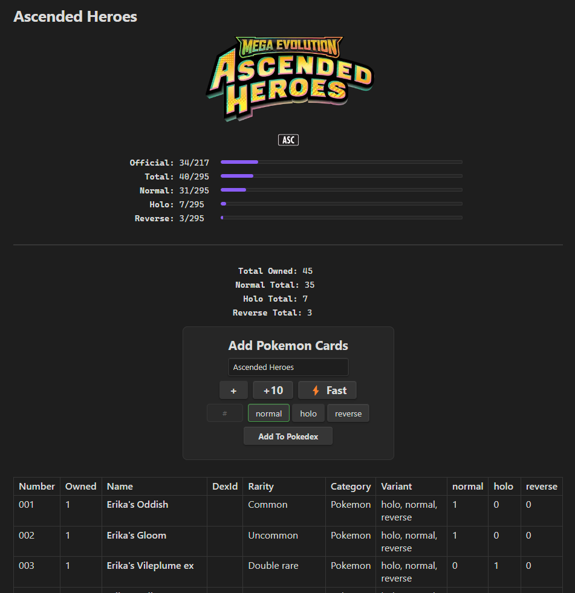
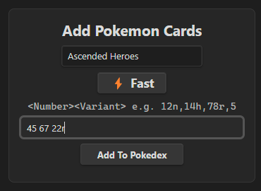

# Pokemon TCG Tracker

An [Obsidian](https://obsidian.md) plugin that helps you track your Pokémon Trading Card Game collection using simple markdown files inside your vault.

  

## Features

### Set Tracking
- Browse and add any Pokémon TCG set from the complete card database.
- Each tracked set generates a markdown file with a full card table including card number, name, Pokédex ID, rarity, category, and variants.
- Set pages display the official set logo and symbol, release date, and live-updating progress bars showing your collection completion.

### Collection Management
- **Card Entry Widget** — An inline widget on each set page for quickly logging new cards. Supports:
  - Individual card entry with variant toggle buttons (normal, holo, reverse, etc.)
  - Bulk entry with a `+10` button for opening booster packs.
  - **Fast Mode** — Type cards in shorthand like `12n,14h,78r,5` for rapid data entry. Numbers without at letter will be the normal variant.
  

  

### Progress Tracking
- Per-set progress bars for official cards, total cards, and each variant type.
- Running totals for owned cards and variants

### Backup & Restore
- **Export / Import** — Back up your entire collection or individual sets to markdown files in a `backups/` folder within your vault.
- **Auto-backup on reset** — Resetting a set file automatically exports a backup first, so you never lose data.
- Backup files are portable markdown with embedded JSON, so they sync with your vault and can be transferred between vaults.

## Settings
- **Vault folder** — Choose where set files are created in your vault (with folder autocomplete).
- **Set management** — Add, remove, reset, export, or import tracked sets.
- **Cached set list** — Sets are fetched once from the API and cached locally to minimize network calls. Refresh manually when needed.

## Future plans
- **Dashboard** — A central page that will display stats for all sets in your collection. 
- **Pricing Info** — Pricing info so you can view the total worth of your sets, most valuable card, etc.. 
- **Pokedex Page** — A page specifically set to track your progress if you are doing a full pokedex challenge.  
- **Import/Export to other apps** — The ability to import/export to other apps

## Ideas? Issues?
- Open a feature request or bug. I think this repo is public. 

## Acknowledgements

Card data is provided by **[TCGdex](https://tcgdex.dev/)** — a free, open-source Pokémon TCG API. Huge thanks to the TCGdex team for maintaining such a comprehensive and accessible database of Pokémon card data. This plugin would not be possible without their work.

- TCGdex Website: [https://tcgdex.dev](https://tcgdex.dev)
- TCGdex GitHub: [https://github.com/tcgdex](https://github.com/tcgdex)
- TCGdex TypeScript SDK: [@tcgdex/sdk](https://www.npmjs.com/package/@tcgdex/sdk)

Pokémon and Pokémon TCG are trademarks of Nintendo, Creatures Inc., and GAME FREAK Inc. This plugin is not affiliated with or endorsed by any of these companies.
